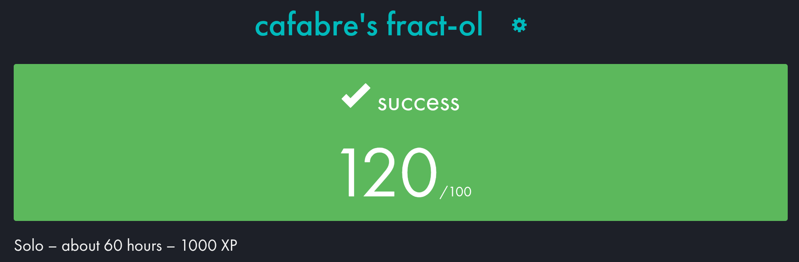
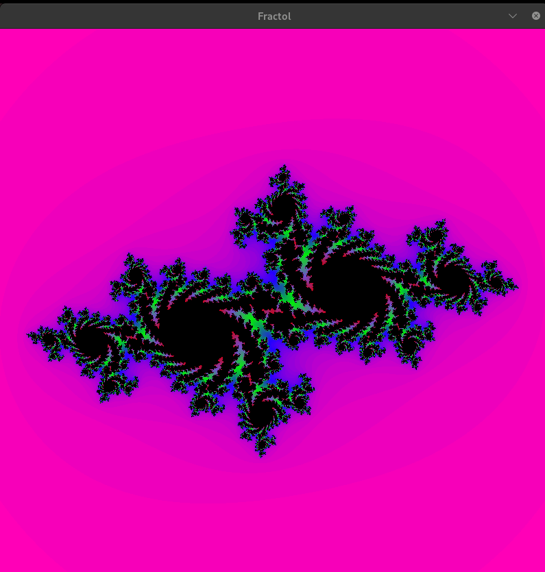
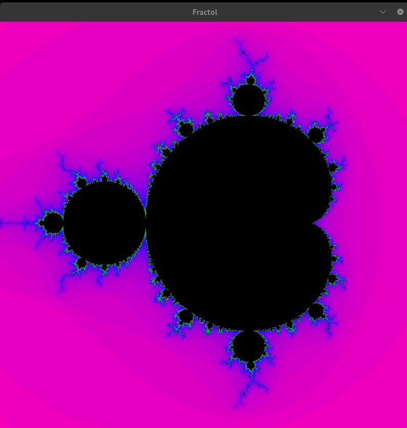

<p align="center>
	<h1>❄️ Fract-ol - Fractal Explorer</h1>
</p>

<p align="center">
	
</p>

## 📖 Description
The **fract-ol** project is the first graphics project in the Ecole 42 curriculum. The goal is to generate fractal sets in real time using the **MiniLibX** library. I also implemented the Burning Ship set as a bonus. This project allows you to manipulate complex numbers and optimize rendering using iterative algorithms.

---

## 🛠️ Installation & Compilation

### Prerequisites
* The `gcc` compiler
* The **MiniLibX** library (to replace by the appropriate version if you are under MacOS).

### Instructions

#### 1. Clone the project
```bash
git clone [https://github.com/cafabre/fractol.git](https://github.com/cafabre/fractol.git)
cd fractol
```

#### 2. Compile the program
```bash
make
```

For Mandelbrot
```bash
./fractol mandelbrot
```

For Julia (takes two complex parameters - optional)
```bash
./fractol julia -0.4 0.6
```

For Burning Ship
```bash
./fractol burning_ship
```

## Usage
Once the program is launched, a window will open with the image of the selected fractal set.
You can move around the image using the arrow keys on your keyboard, and zoom in and out using the mouse scroll wheel. The zoom will follow the position of the cursor.

## Screenshots
<p align="center">
	
</p>

<p align="center">
	
</p>